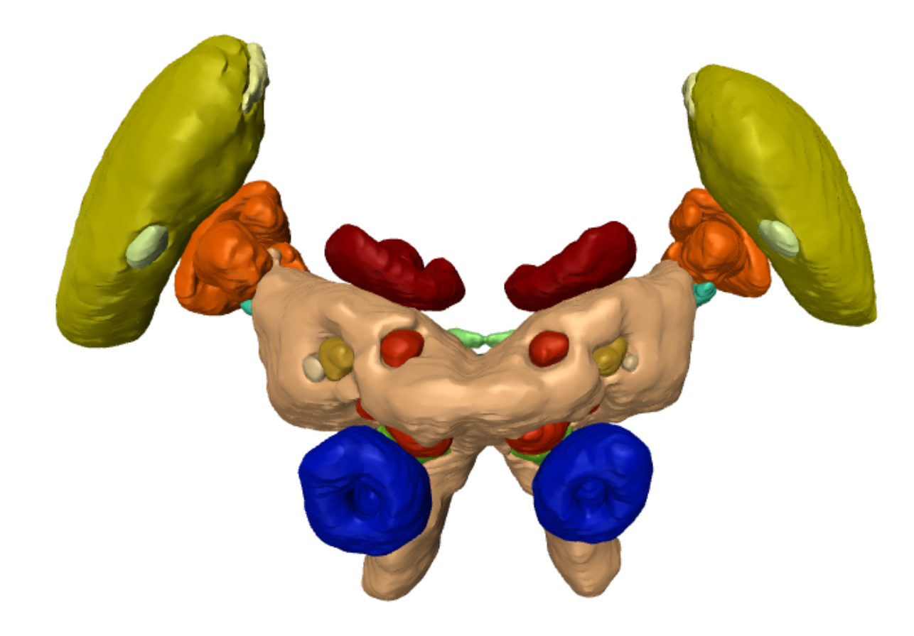
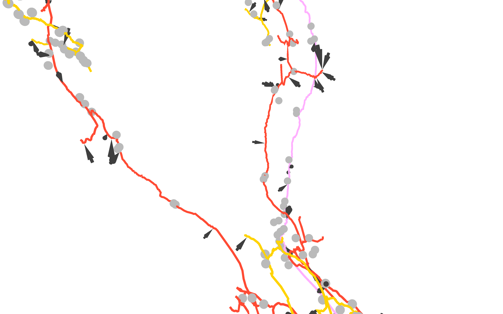

`Brainrender` has been designed to work flexibly with data from any source. This means that `brainrender` can be used to render anatomical data from species other than the mouse. 

While there's currently no officially supported brain atlas other than the mouse [[we're working on it](https://github.com/brainglobe/brainglobe)], it's easy to create custom `Atlas` classes to create brainrender `scenes` for species other than the mouse. 

## Using custom  `Atlas` clases
The core `brainrender` class for creating scenes is `brainrender.scene.Scene`. By default `Scene` uses the `aba` (`brainrender.atlases.aba` | aba stands for Allen Brain Atlas) to fetch and parse data to populate the scene. 
You can pass a custom `Atlas class` to `Scene` to use your class' methods for fetching data.

To develop a custom `Atlas` class you can use `brainrender.atlases.base.Atlas` as a template [e.g. see how `aba` redifines `brainrender.atlases.base.Atlas` methods to get data from the Allen Brain Atlas]. You don't need to support all of `brainrender.atlases.base.Atlas`' methods, but the more you have in your you have in your custom atlas class, the more you can add to your `scenes`.


---------
----------------------------------------------------------------


# Examples
You can check `brainrender.atlases.insect_brains_db.py` and `brainrender.atlases.celegans.py` for two examples of custom `Atlas` classes. 


## Insect brains
`brainrender.atlases.insect_brains_db.py` defines a class `IBDB` which downloads brain structures data from [insectbraindb.org]( https://insectbraindb.org/app/), a website that hosts several databeses with reconstructions of insect brains.

By using `IBDB` when creating a `brainrender` `scene`, you can render brain structures from the insect brains:

# BrainRender
<p align="center">
  
  <p>Reconstruction of the locust brain from insectbraindb.org</p>
</p>


Check out [insects_brains.py](Examples/custom_atlases/insects_brains.py) to learn how to use `IBDB`

```
from brainrender.scene import Scene
from brainrender.atlases.insects_brains_db import IBDB

scene = Scene(atlas=IBDB, # specify that we are using the insects brains databse atlas
    atlas_kwargs=dict(species='Schistocerca gregaria')
    )
```

------------
https://insectbraindb.org/app/

The InsectBrainDB.org is primarily curated by Stanley Heinze

The insectbraindb.org has a terms of use, which provides guidance on how best to credit data from these repositories. 

The insectbraindb.org is primarily curated by Dr. Stanley Heinze, and 
was buily by Kevin Tedore, and has several significant supporters, including the ERC.

Please aknowledge the original data source when using these classes

---------


#### *C. Elegans* connectome
The `Celegans` class from `brainrender/atlases/celegans.py` is a good starting point
for learning how to expand `brainrender`'s functinality to datasets not already supported. 

`Celegans` class defines a custom `Atlas` class than can be used with `brainrender` `Scene` to visualise
*C. Elegans* connectomica data from [this preprint](https://www.biorxiv.org/content/10.1101/2020.04.30.066209v1).


Whole connectome             |  Synaptic locations
:-------------------------:|:-------------------------:
 |  


Check out [celegans_connectome.py](Examples/custom_atlases/celegans_connectome.py) to learn how to use `Celegans`


----------------------------------------------------------------
All data from Daniel Witvliet and co-authors.

Check https://www.biorxiv.org/content/10.1101/2020.04.30.066209v1 
for more details.

Please aknowledge the original data source when using these classes

-------------