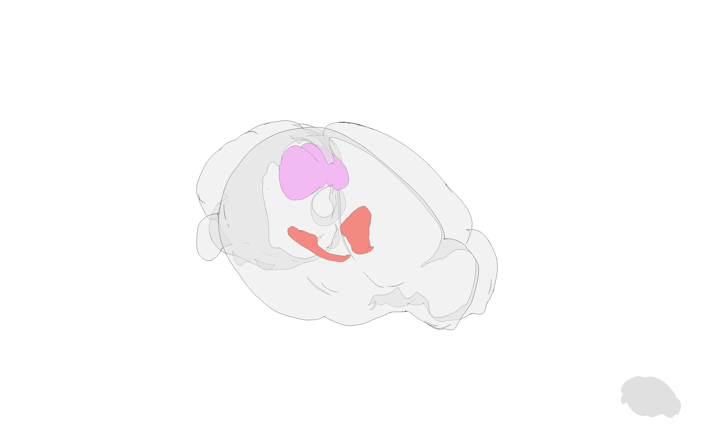
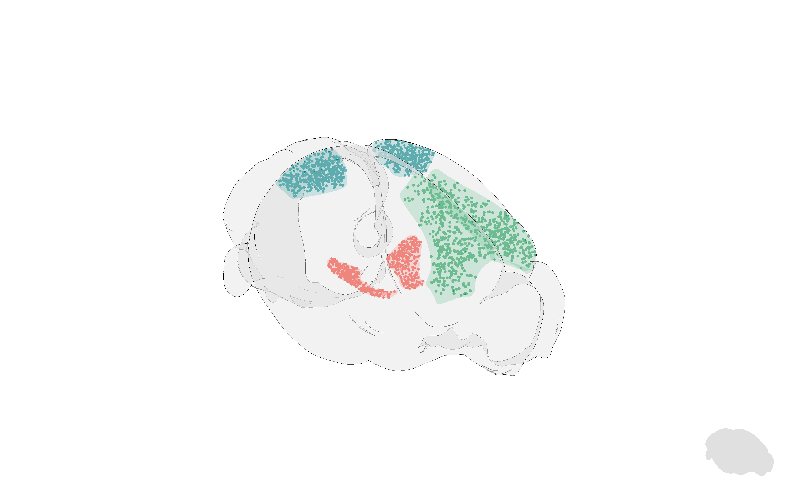
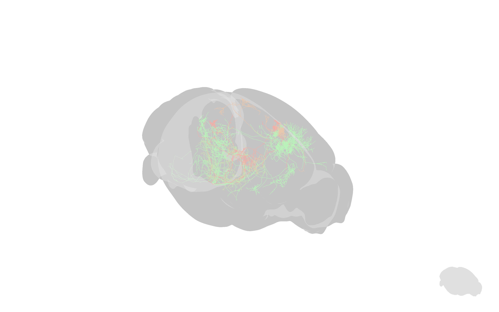
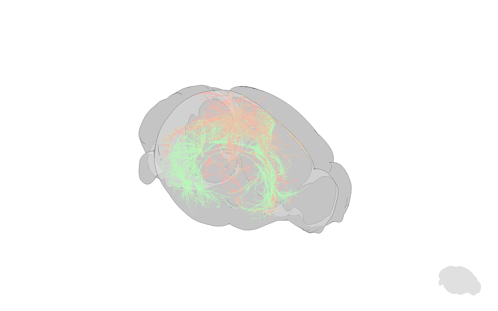
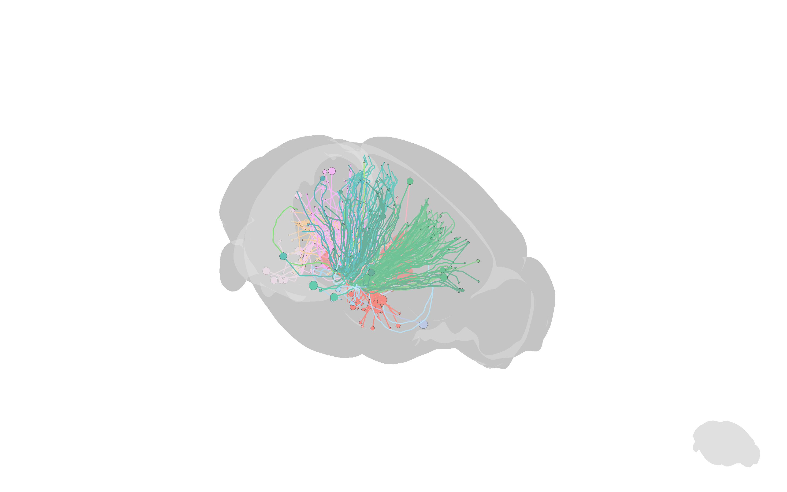
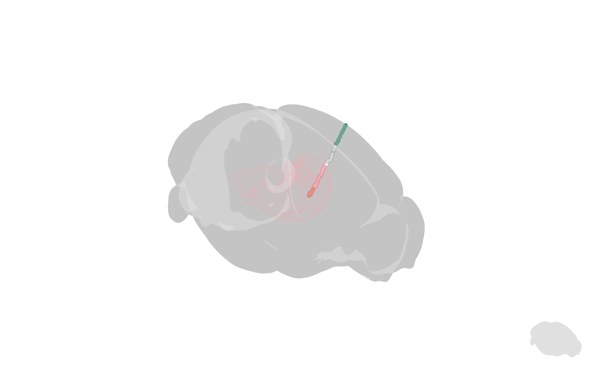
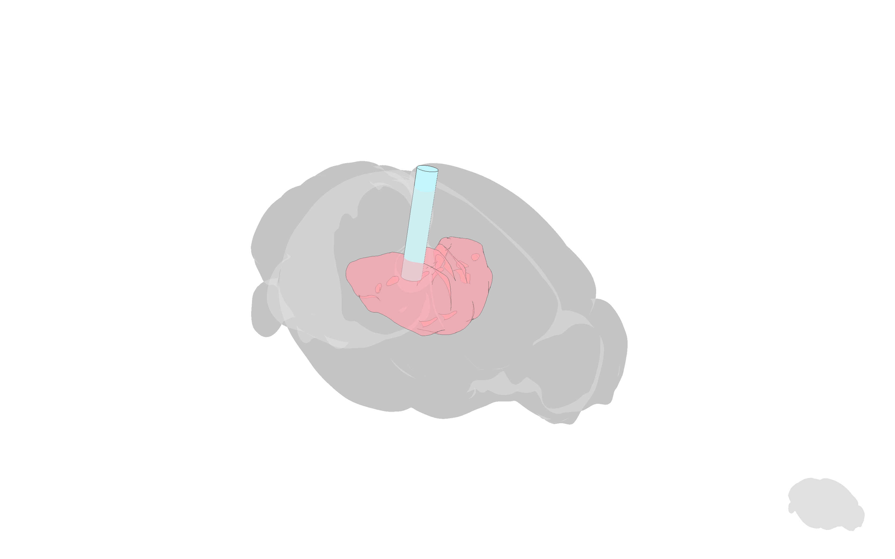
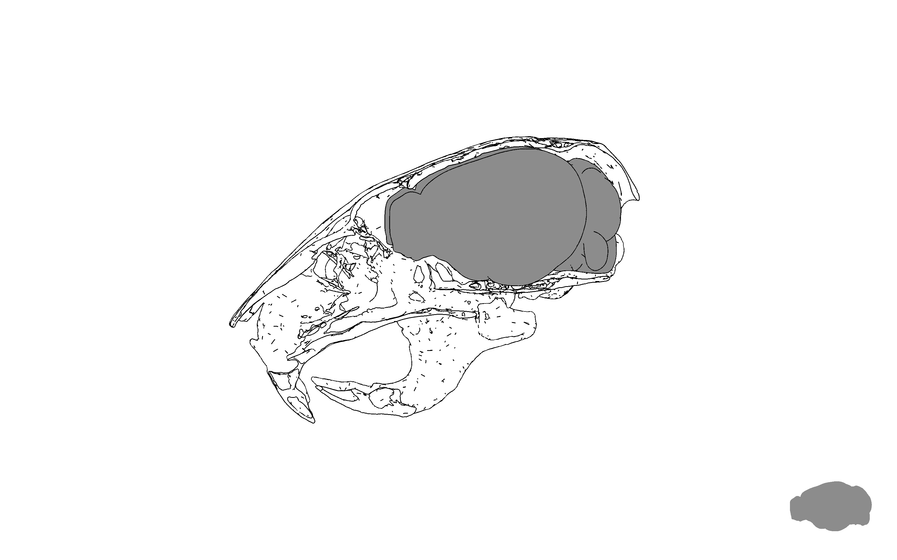
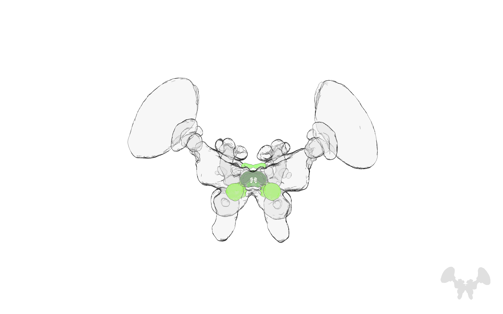
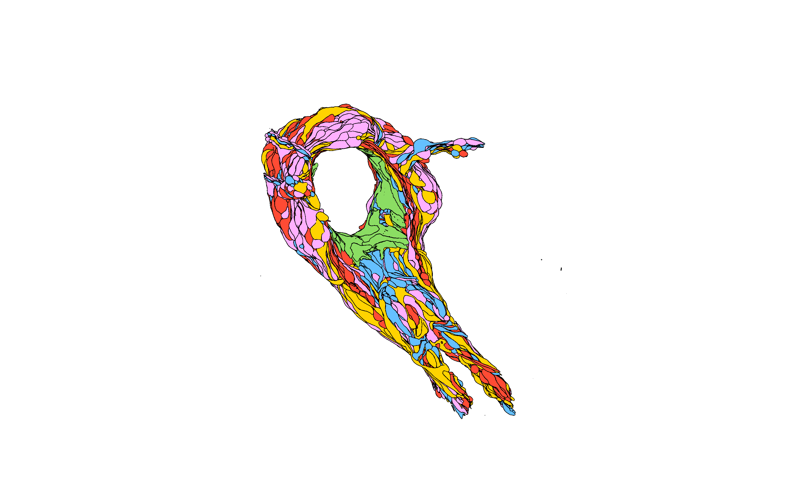

# BrainRender
<p align="center">
  
</p>


`brainrender` is a python package for the visualization of three dimensional neuroanatomical data. 
It can be used to render data from publicly available dataset (e.g. Allen Brain atlas) as well as user generated experimental data. 
The goal of brainrender is to faciliate the exploration and dissemination of neuroanatomical data by providing a user-friendly platform to create high-quality 3D renderings. 


For more information about `brainrender` and how to use it, please check the [brainrender docs](https://docs.brainrender.info/).
You can also have a look at the [brainrender preprint](https://www.biorxiv.org/content/10.1101/2020.02.23.961748v1) and the [examples](https://docs.brainrender.info/overview/examples) and [tutorials](https://github.com/BrancoLab/BrainRender/tree/master/Examples).
You can find interactive examples of data visualisations generated with brainrender [here](https://fedeclaudi.github.io/br-info.html) and a gallery of images created with brainrender [here](https://docs.brainrender.info/overview/gallery).


<p align="center">

</p>


# Installation
To install `brainrender`, you use an existing python environment or [create](https://docs.conda.io/projects/conda/en/latest/user-guide/tasks/manage-environments.html) a new one [with `python < 3.8`]. Then simply install with:
```
pip install brainrender - U
``` 
If you want the most recent version of `brainrender`'s code, you can get it directly from github with:
```
pip install -U git+https://github.com/BrancoLab/BrainRender.git
```

To quickly check that everything worked for your installation, try creating a brainrender scene directly from the terminal. 
```
  brainrender TH STR -c
```


# Usage
`brainrender` relies on brainglobe's [brainatlas-api](https://github.com/brainglobe/brainatlas-api) to fetch structural and morphological data for various brain atlases, including two mice atlases, one zebrafish atlas and one atlas of the human brain. Much of what brainrender can do works across all of these atlases. Basic functionality supported by `brainrender` inclused the display of anatomical brain region, the position of labelled cells from tracking experiments (e.g. as obtained with tools like [cellfinder](https://github.com/SainsburyWellcomeCentre/cellfinder)) and whole-cell neuronal morphological reconstructions. Click on the images below to see aexamples  of how to use brainrender:


Brain structures             |  Labelled cells        |  Neuron reconstructions
:-------------------------:|:-------------------------:|:-------------------------:
<a href="Examples/basic/brain_regions.py" target="_blank"><br>`brain_regions.py` </a>| <a href="Examples/basic/labelled_cells2.py" target="_blank"><br>`labelled_cells2.py`</a> |  <a href="Examples/mouse/colored_neurons.py" target="_blank"><br>`colored_neurons.py`</a>


## Mouse brain-specific
Some of brainrenders functionality is specific to the atlases based on the Allen mouse brain atlas. This includes functionality to render publicly available as well as user-generated data.

### Publicly available datasets
Brainrender can be used to download a visualize a neuroanatomical data from several publicly available datasets based on the Allen Atlas of the mouse brain.
Anatomical and projection data is downloaded from the  Allen Brain Atlas [reference atlas](http://atlas.brain-map.org)
and [connectivity atlas](http://connectivity.brain-map.org) using the Allen [API](http://help.brain-map.org/display/api/Allen%2BBrain%2BAtlas%2BAPI)
(© 2015 Allen Institute for Brain Science. Allen Brain Atlas API. Available from: [https://brain-map.org/api/index.html](https://brain-map.org/api/index.html)) ([1], [2]). Brainrender can also be used to download and visualise gene expression data from the Allen database and
neurons morphological data from Janelia's [mouse light](https://www.janelia.org/project-team/mouselight) project
(see the [neurons browser](http://ml-neuronbrowser.janelia.org)). [3]


Streamlines             |  Tractography        |   
:-------------------------:|:-------------------------:|
<a href="Examples/mouse/streamlines.py" target="_blank"><br>`streamlines.py`</a> | <a href="Examples/mouse/tractography.py" target="_blank"><br>`tractography.py` </a>


gene expression | MouseLight
:-------------------------:|:-------------------------:|
 <a href="Examples/mouse/gene_expression.py" target="_blank"><br>`gene_expression.py`</a> |  <a href="Examples/mouse/mouselight.py" target="_blank"><br>`mouselight.py`</a>

### User generated
`brainrender` can be used to visualise the location of implanted neuropixel probes with data from [SHARP TRACK](https://github.com/cortex-lab/allenCCF).
Neuropixel             | 
:-------------------------:|
<a href="Examples/user_data/sharptrack.py" target="_blank"><br>`sharptrack.py` </a>| 


## Exporting
To facilitate the creation of scientific illustrations, brainrender let's you take screenshots of your scenes, create animated videos and embed [interactive visualisations](https://fedeclaudi.github.io/br-info.html) scenes in your website. 

To learn how to do it, check these examples:
 - [screenshot](Examples/export/screenshots.py)
 - [video1](Examples/export/basic_video_maker.py) - [video2](Examples/advanced/custom_videomaker.py)
 - [animation](Examples/advanced/animated_scene.py)
 - [export for web](Examples/export/export_for_web.py)


## Other
`brainrender` relies on the powerful `vedo`(https://vedo.embl.es) ([github](https://github.com/marcomusy/vedo)) rendering engine, thus providing you with the flexibility to render just about anything you might need for your visualisation. As an example, here you can see how to visualise the location of an implanted optic fiber or any other 3d object from an `.stl` or `.obj` file. 


Optic fibre             |  .stl file visualisation | .obj file visualisation
:-------------------------:|:-------------------------:|:-------------------------: 
<a href="Examples/user_data/add_optic_cannula.py" target="_blank"><br>`add_optic_cannula.py` </a>| <a href="Examples/user_data/add_object_to_scene.py" target="_blank"><br>`add_object_to_scene.py`  </a> | <a href="Examples/user_data/add_object_to_scene.py" target="_blank"><br>`add_object_to_scene.py`</a>


A few more things you can do to improve your visualizations:
- [reveal what's inside a 3d object](Examples/basic/cut_with_plane1.py) by cutting it in half.
- [add a title](Examples/basic/scene_title.py) or [3d text](Examples/basic/add_text_3d.py) to your scene 
- [label](Examples/basic/adding_labels.py) elements in your scene, so that you always know what you're looking at.
- create [multiscenes](Examples/basic/multiscene.py) to look at several pieces of data at once. 
- change the overall [look](Examples/basic/cartoon_look.py) of your scenes
- and more...


## Other atlases
In addition to the atlases supported by `brainatlas-api`, you can easily create new `Atlas` classes to support the visualisation of your own datasets in `brainrender` (see [here](Docs/custom_atlases.md) for more details). As a way of example we provide two such classes. One to visualise insect brains from [insectbraindb.org]( https://insectbraindb.org/app/) and one for _C. Elegans_ connectome data from Daniel Witvliet's recent [preprint](https://www.biorxiv.org/content/10.1101/2020.04.30.066209v1).

Insect brains             |  _C. Elegans_ connectome   
:-------------------------:|:-------------------------:
<a href="Examples/custom_atlases/insects_brains.py" target="_blank"><br>`insects_brains.py` </a>| <a href="Examples/custom_atlases/celegans_connectome.py" target="_blank"><br>`celegans_connectome.py` </a>


# Getting in touch
If you're unsure how to use `brainrender`, please start by having a look at the  [user guide](https://github.com/BrancoLab/BrainRender/blob/master/Docs/UserGuide.md) and the [examples](https://github.com/BrancoLab/BrainRender/blob/master/Examples) notebooks. If you still have unanswered questions, please do not hesitate to get in touch (the easiest way is to open an issue on github). 

For any bug report or feature request, please open an issue with a brief description of the matter. 
Although brainrender can already to much, we are always happy to add more functionality that could be useful for users. If you spot some feature that is missing, we'd love to hear about is so please get in touch!


## Referencing Brain Render
If you found BrainRender useful and decided to include a rendering in your talks, posters or article, please acknowledge BrainRender's contribution by citing the [brainrender preprint](https://www.biorxiv.org/content/10.1101/2020.02.23.961748v1) as:
```
Brainrender. A python based software for visualisation of neuroanatomical and morphological data.
Federico Claudi, Adam L. Tyson, Tiago Branco
bioRxiv 2020.02.23.961748; doi: https://doi.org/10.1101/2020.02.23.961748 
```


# Similar tools
## In R
`cocoframer` is an R library for interacting with the Allen's Mouse CCF [github repository](https://github.com/AllenInstitute/cocoframer).

`mouselightr` package generates 3D CCF mouse brain plots, along with MouseLight neuron reconstructions [github repository](https://github.com/jefferis/nat.mouselight)

### In Matlab
`BrainMesh` is a Matlab GUI for rendering 3D mouse brain structure [github repository](https://github.com/Yaoyao-Hao/BrainMesh).


## References
* [1] Lein, E.S. et al. (2007) Genome-wide atlas of gene expression in the adult mouse brain, Nature 445: 168-176. doi:10.1038/nature05453
* [2] Oh, S.W. et al. (2014) A mesoscale connectome of the mouse brain, Nature 508: 207-214. doi:10.1038/nature13186
* [3]  Winnubst, J. et al. (2019) Reconstruction of 1,000 Projection Neurons Reveals New Cell Types and Organization of Long-Range Connectivity in the Mouse Brain, Cell 179: 268-281
* [4] Knowx et al (2018). High-resolution data-driven model of the mouse connectome. -->


# Behind the scenes
Brainrender was deisgned to be a powerful and flexible software for downloading and rendering neuroanatomical data while still being relatively easy to use (using brainrender requires minimal coding experience). 
This was achieved by: 
  1) handling the interaction with the API, SDK and databases services used to find and download the data behind the scenes, requiring minimal user input. 
  2) Using [vedo](https://vedo.embl.es) to handle the rendering. vedo  ([github repo](https://github.com/marcomusy/vedo)) is a powerful rendering engine that produces high quality three dimensional rendering. vedo is also flexible, meaning that it can handle data provided in various file formats, allowing `brainrender` to render data from various sources. 

