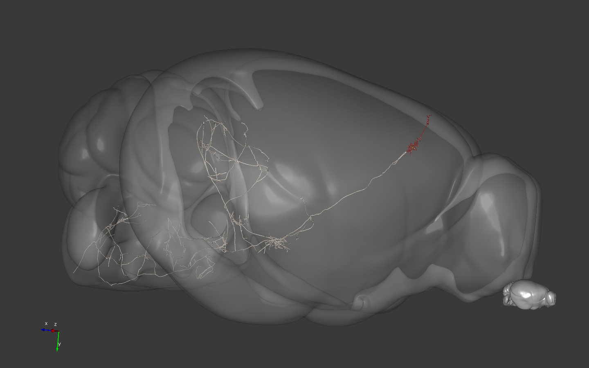
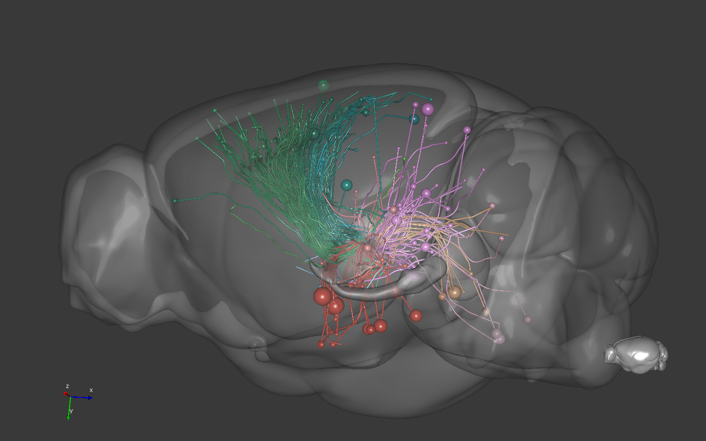
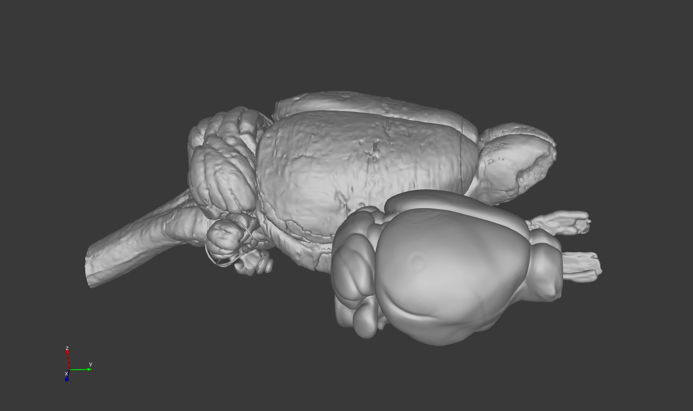

# BrainRender
Python scripts to create 3D renderings of mouse brain anatomical and projection data and neurons reconstructions. 

### Resources
Anatomical and projection data is downloaded from the  Allen Brain Atlas [reference atlas](http://atlas.brain-map.org)
and [connectivity atlas](http://connectivity.brain-map.org) using the Allen [API](http://help.brain-map.org/display/api/Allen%2BBrain%2BAtlas%2BAPI)
(© 2015 Allen Institute for Brain Science. Allen Brain Atlas API. Available from: [brain-map.org/api/index.html](brain-map.org/api/index.html)) 
([1], [2]).
Streamlines reconstructions are made by [https://neuroinformatics.nl](https://neuroinformatics.nl) using the mouse connectome data from Allen (see [here](https://neuroinformatics.nl/HBP/allen-connectivity-viewer/streamline-downloader.html) for more details)

Neurons morphological data is from Janelia's [mouse light](https://www.janelia.org/project-team/mouselight) 
(see the [neurons browser](http://ml-neuronbrowser.janelia.org)). [3]

BrainRender also includes meshes for a reconstruction of the rat brain. These meshes are obtained and modified from  
[3D-rat-brain](https://github.com/tfiers/3D-rat-brain) from [tfiers](https://github.com/tfiers). Original 
data from [4] and [5]. 

To create the render BrainRender relies on [vtkplotter](https://vtkplotter.embl.es) [see [github repo](https://github.com/marcomusy/vtkPlotter)].

# Examples
Check the [user guide](UserGuide.md) and the [examples](Examples) for more information

## Mouse Light neurons morphology rendering

Motor cortex piramidal neuron reconstruction from Mouse Light.

## Rendering of different sets of brainstem projecting neurons using MultiScene

Sets of neurons projecting to the brainstem, sorted by brain region.

## Allen mouse connectome projection data rendering
### Tractography

Projections to the Zona Incerta, colored by projection area.

### Streamlines

Efferents from the VAL nucleus of the thalamus.

### Streamlines

Efferents from the VAL nucleus of the thalamus.

### Ratbrain

The rat and mouse brains side by side. 

## Referencing Brain Render
If you found BrainRender useful and decided to include a rendering in your talks, posters or article, please aknowledge BrainRender's contribution.

## References
* [1] Lein, E.S. et al. (2007) Genome-wide atlas of gene expression in the adult mouse brain, Nature 445: 168-176. doi:10.1038/nature05453
* [2] Oh, S.W. et al. (2014) A mesoscale connectome of the mouse brain, Nature 508: 207-214. doi:10.1038/nature13186
* [3] [MouseLight preprint] (https://www.biorxiv.org/content/10.1101/537233v1)
* [4] [Papp et al. 2014](https://www.sciencedirect.com/science/article/pii/S1053811914002419)
* [5] [Kjonigsen et al. 2015](https://www.sciencedirect.com/science/article/pii/S105381191500004X)
