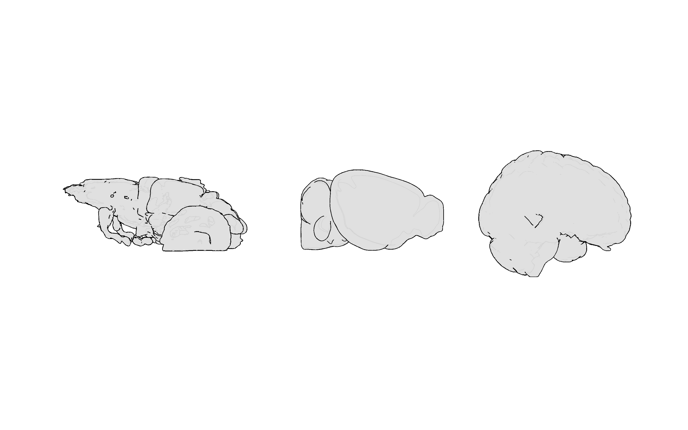
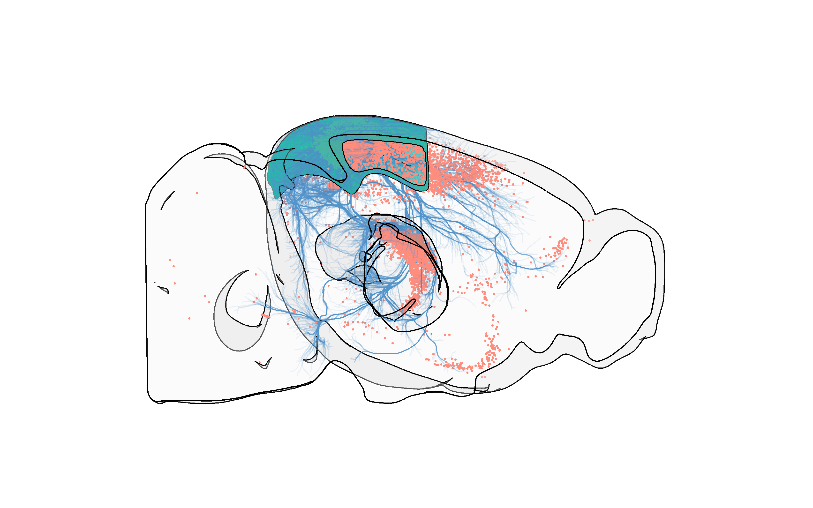
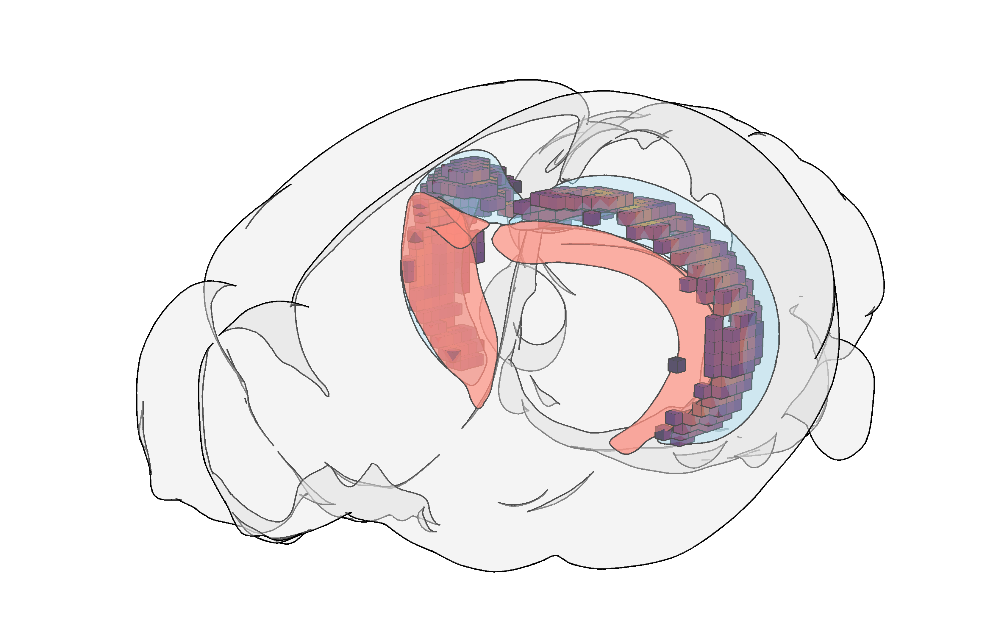
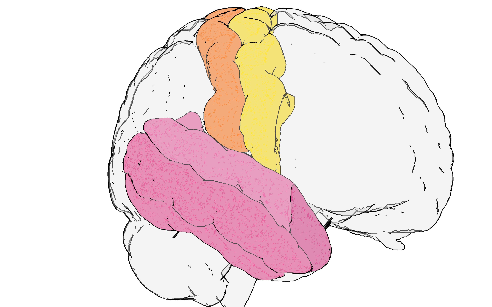
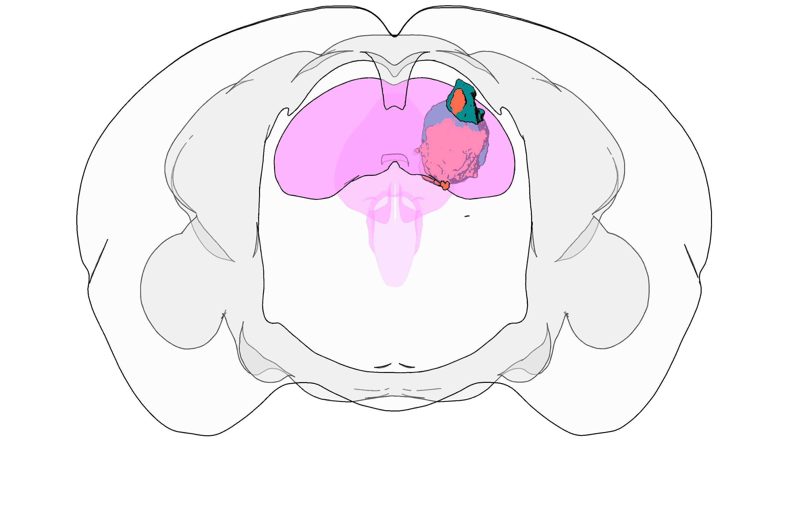
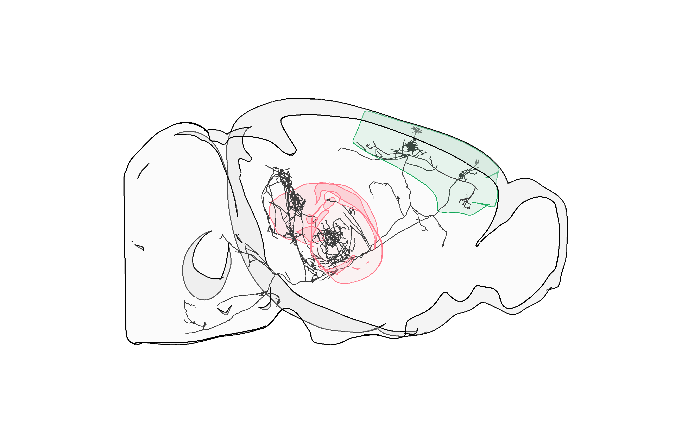
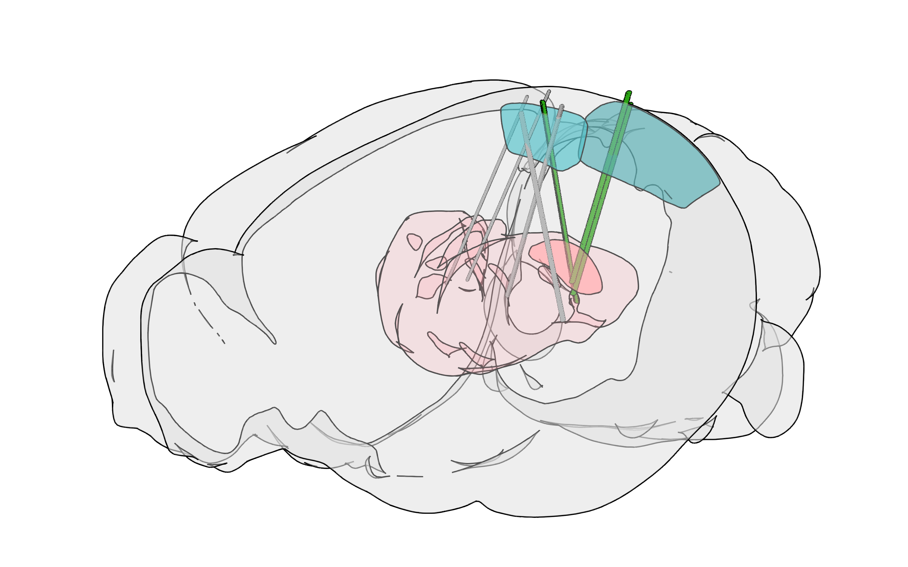
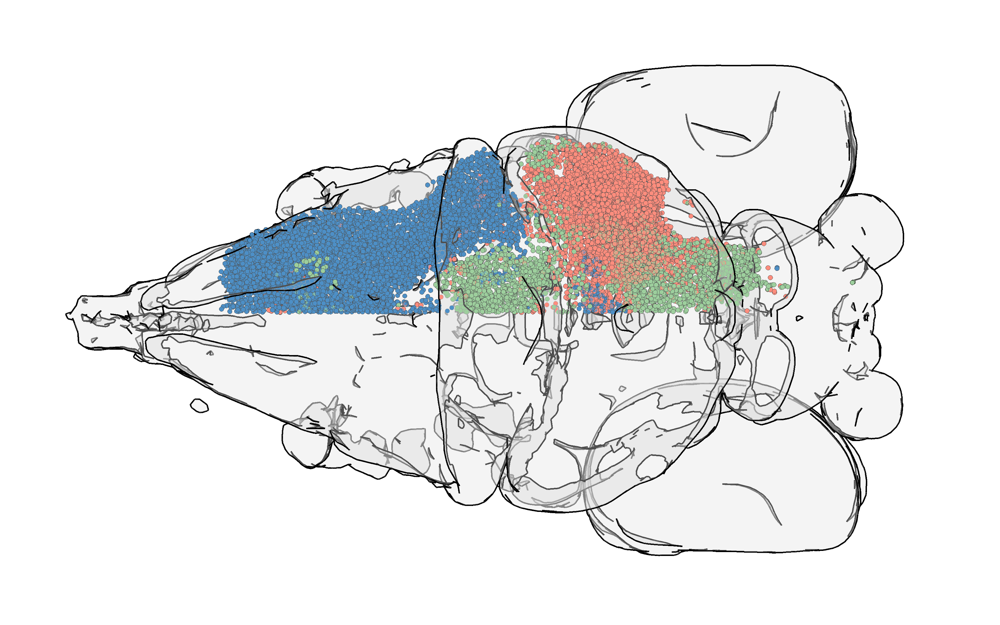
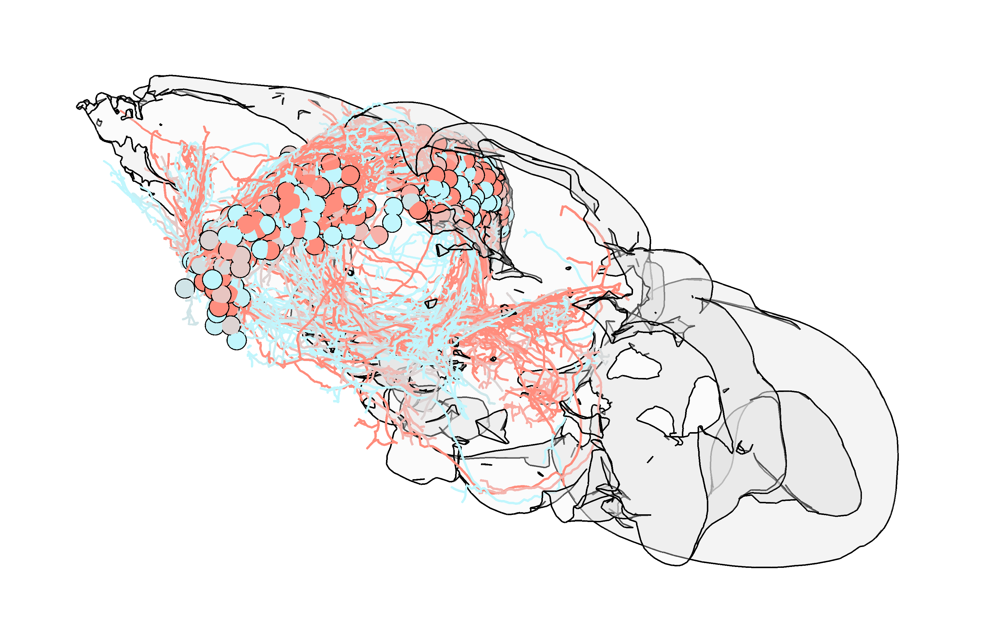
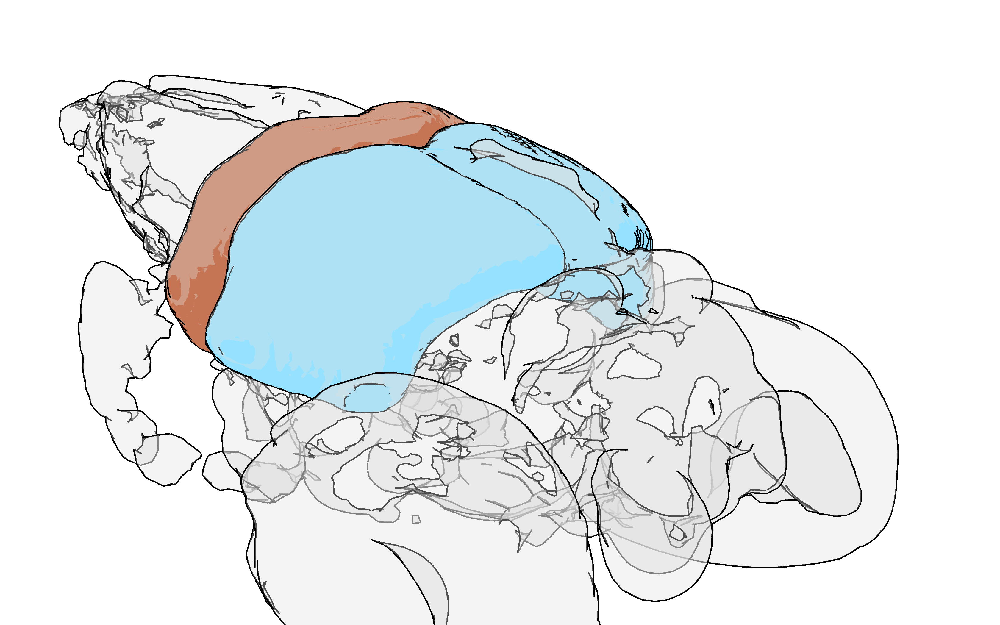

# Brainrender
<p align="center">
  
</p>

[](https://pypi.org/project/brainrender)
[](https://pypi.org/project/brainrender)
[](https://travis-ci.com/brainglobe/brainrender)
[](https://www.gnu.org/licenses/gpl-3.0)
[](https://coveralls.io/github/brainglobe/brainrender)
[](https://github.com/python/black)

**!! NOTE: you're looking at brainrender v2.0**
We have recently released a new version of `brainrender`, version 2.0 (:tada:). This consists of an entire re-writing of the whole library to make the code cleaner, more compact. easier to read and easier to use.
We've also included a new GUI packaged with `brainrender`.
However, this does mean that code written to work with previous versions of `brainrender` will need to be adjusted slightly to work with the newer versions.
If you are transitioning to the new `brainrender` version, please reade [the guide we have put together](https://docs.brainrender.info/usage/overview/v1-greater-than-v2) about moving from v1.0 to v2.0.

**`brainrender` is a python package for the visualization of three dimensional neuro-anatomical data. It can be used to render data from publicly available data set (e.g. Allen Brain atlas) as well as user generated experimental data. The goal of brainrender is to facilitate the exploration and dissemination of neuro-anatomical data by providing a user-friendly platform to create high-quality 3D renderings.**

## Docs
:books: [brainrender docs](https://docs.brainrender.info/).

:paper: [brainrender paper](https://www.biorxiv.org/content/10.1101/2020.02.23.961748v1.article-metrics)

## Installation
You can [install `brainrender`](https://docs.brainrender.info/installation/installation) with:

```
pip install brainrender
``` 

## Citing brainrender
If you use `brainrender` in your work, please cite:
```
  Claudi, Federico, Adam L. Tyson, and Tiago Branco. 2020. “Brainrender. A Python Based Software for Visualisation of Neuroanatomical and Morphological Data.” Cold Spring Harbor Laboratory. https://doi.org/10.1101/2020.02.23.961748.
```

## Examples
The following images were created for the publication of the [brainrender paper](https://www.biorxiv.org/content/10.1101/2020.02.23.961748v1.article-metrics). References to the original data being visualised can also be found in the paper.

<p align="center">
</img>
</p>
<p align="center">
</img>
</p>
<p align="center">
</img>
</p>
<p align="center">
</img>
</p>
<p align="center">
</img>
</p>
<p align="center">
</img>
</p>
<p align="center">
</img>
</p>
<p align="center">
</img>
</p>
<p align="center">
</img>
</p>
