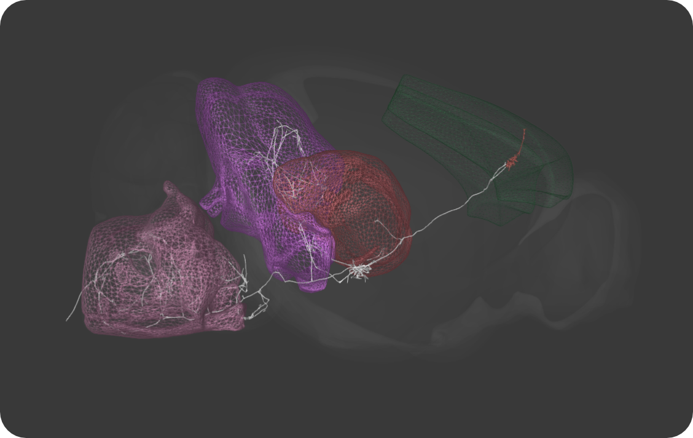
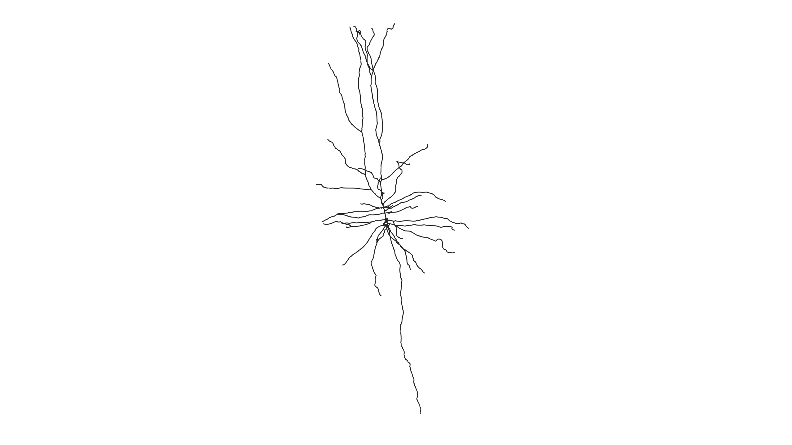
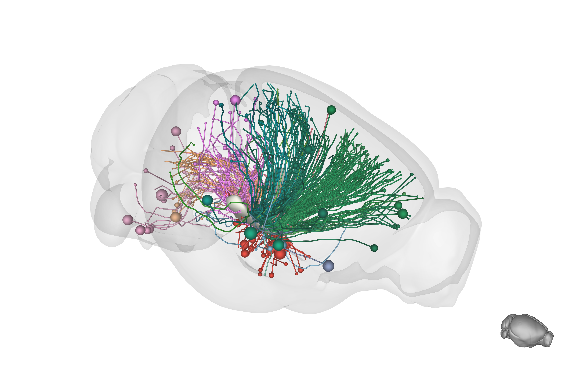
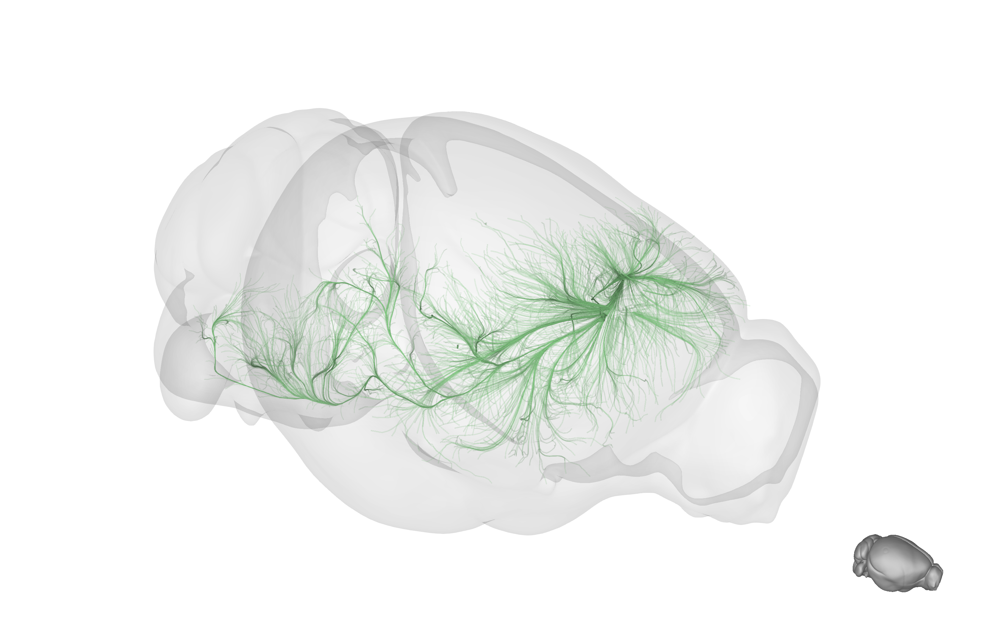

# BrainRender
Functions for the Allen Institute's Mouse Common Coordinate Framework (CCF) and Mouse Light (Janelia) neurons
reconstructions in Python. Check the [user guide](Docs/UserGuide.md) and the [examples](Examples) notebooks for more information
on how to use BrainRender.

## Resources
### Allen Mouse Brain Atlas
Anatomical and projection data is downloaded from the  Allen Brain Atlas [reference atlas](http://atlas.brain-map.org)
and [connectivity atlas](http://connectivity.brain-map.org) using the Allen [API](http://help.brain-map.org/display/api/Allen%2BBrain%2BAtlas%2BAPI)
(© 2015 Allen Institute for Brain Science. Allen Brain Atlas API. Available from: [brain-map.org/api/index.html](brain-map.org/api/index.html)) ([1], [2]).

An interactive, in-browser 3D structure viewer, the Allen Brain Explorer, is available [here](http://connectivity.brain-map.org/3d-viewer?v=1). 

### Streamlines
Streamlines refer to the visualization of efferent projection as determined by local injections of an anterogradely transported virus (see [Allen's connectivity atlas](http://connectivity.brain-map.org)).
Streamlines reconstructions are made by [https://neuroinformatics.nl](https://neuroinformatics.nl) using the mouse connectome data from Allen (see [here](https://neuroinformatics.nl/HBP/allen-connectivity-viewer/streamline-downloader.html) for more details).

### Mouselight neurons morphology
Neurons morphological data is from Janelia's [mouse light](https://www.janelia.org/project-team/mouselight) database
(see the [neurons browser](http://ml-neuronbrowser.janelia.org)). [3]

### 3D rendering in python
To create the render BrainRender relies on [vtkplotter](https://vtkplotter.embl.es) [see [github repo](https://github.com/marcomusy/vtkPlotter)].

# Example screenshots. 
## Mouse Light neurons morphology rendering

Motor cortex piramidal neuron reconstruction from Mouse Light.

## Rendering of different sets of brainstem projecting neurons using MultiScene

Sets of neurons projecting to the brainstem, sorted by brain region.

## Allen mouse connectome projection data rendering
### Tractography

Projections to the Zona Incerta, colored by projection area.

### Streamlines

## Video

## Referencing Brain Render
If you found BrainRender useful and decided to include a rendering in your talks, posters or article, please accessknowledge BrainRender's contribution.

# Similar tools
## In R
`cocoframer` is an R library for interacting with the Allen's Mouse CCF [github repository](https://help.github.com/en/articles/creating-and-highlighting-code-blocks).

`mouselightr` package generates 3D CCF mouse brain plots, along with MouseLight neuron reconstructions [github repository](https://github.com/jefferis/nat.mouselight)

## References
* [1] Lein, E.S. et al. (2007) Genome-wide atlas of gene expression in the adult mouse brain, Nature 445: 168-176. doi:10.1038/nature05453
* [2] Oh, S.W. et al. (2014) A mesoscale connectome of the mouse brain, Nature 508: 207-214. doi:10.1038/nature13186
* [3] [MouseLight preprint] (https://www.biorxiv.org/content/10.1101/537233v1)
<!-- * [4] [Papp et al. 2014](https://www.sciencedirect.com/science/article/pii/S1053811914002419)
* [5] [Kjonigsen et al. 2015](https://www.sciencedirect.com/science/article/pii/S105381191500004X) -->
