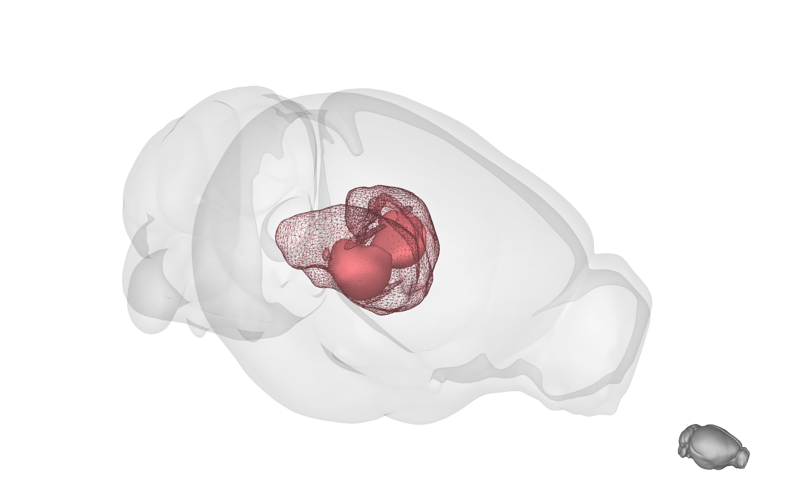
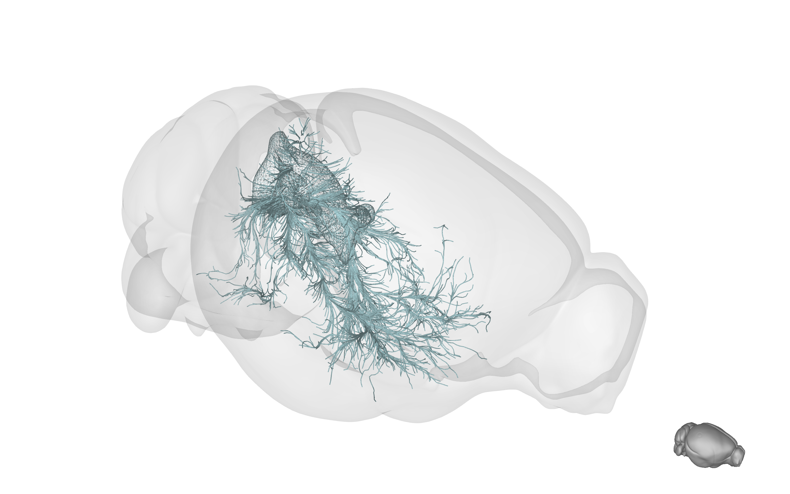
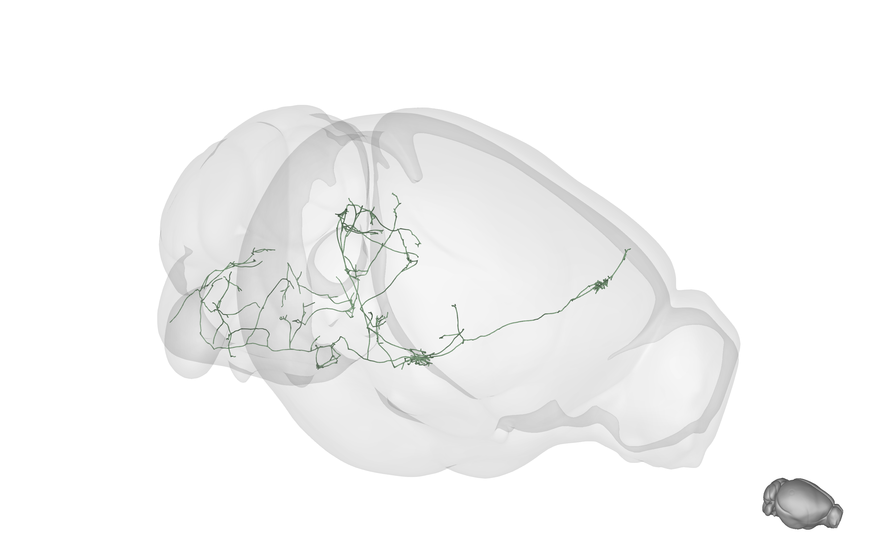
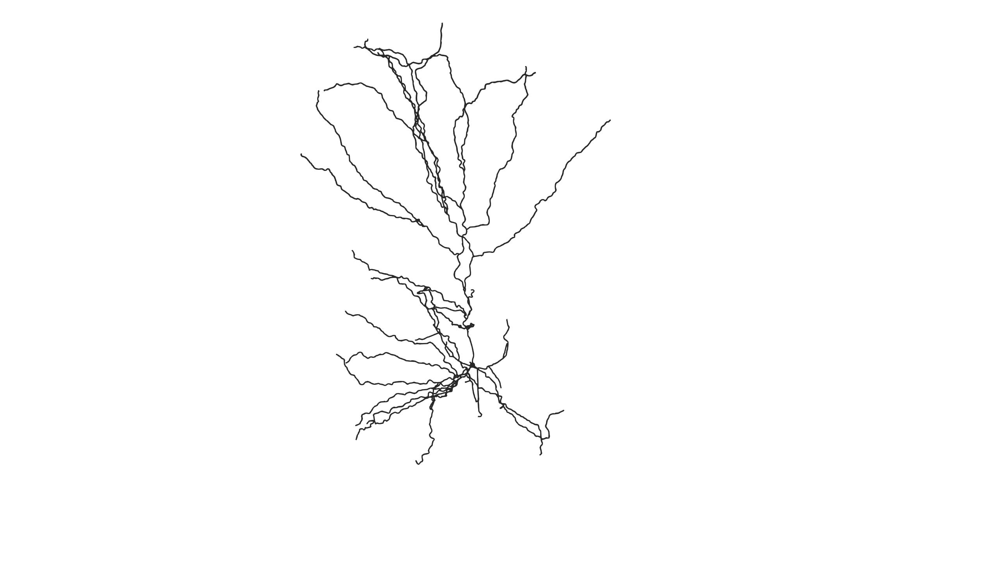
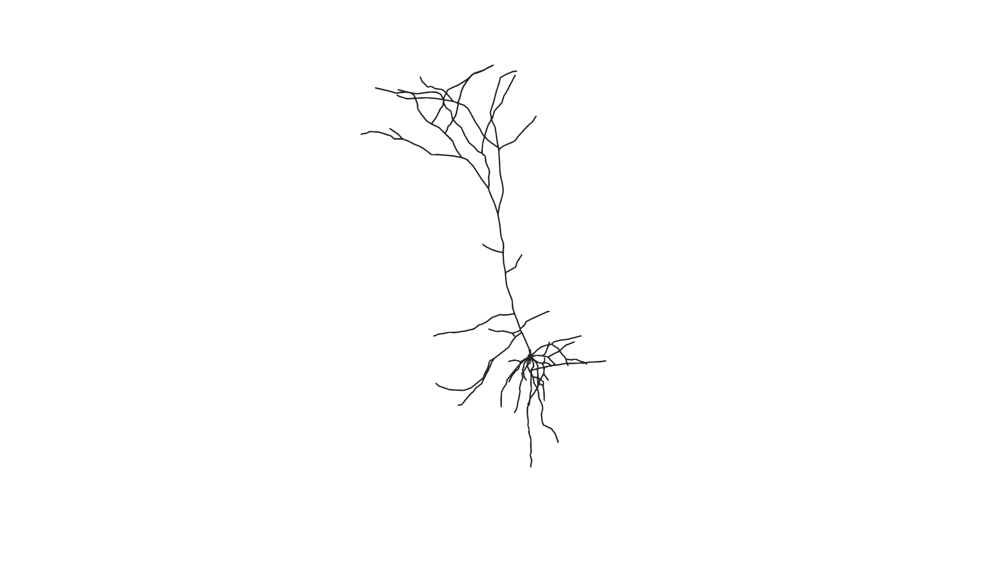
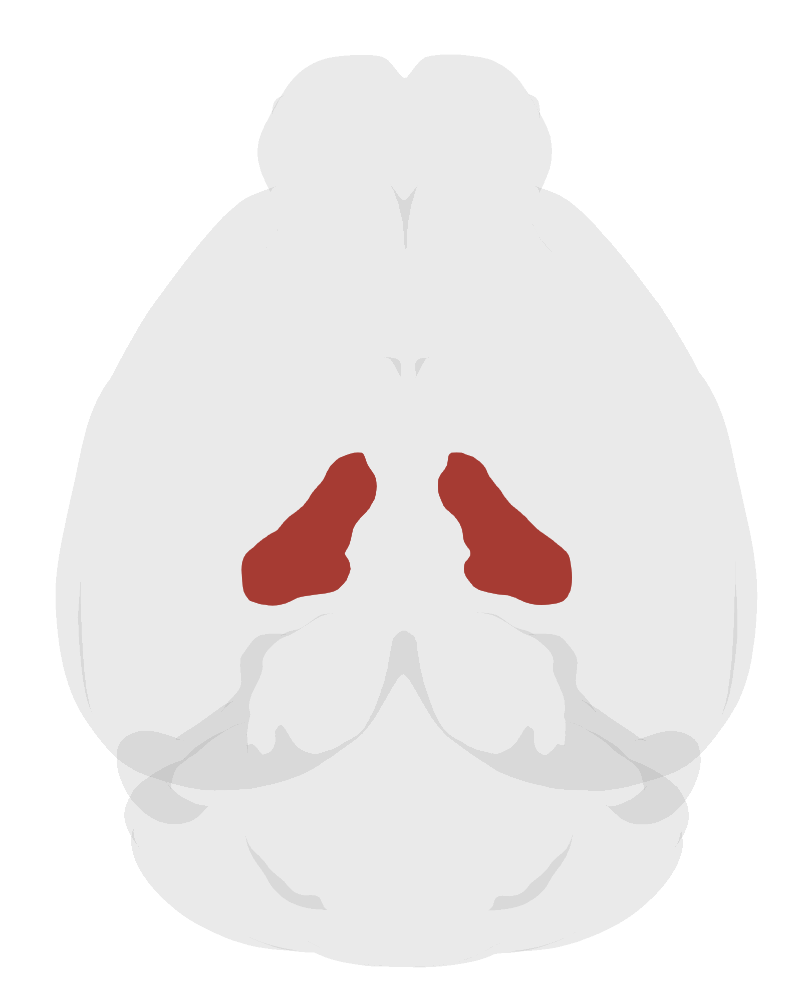
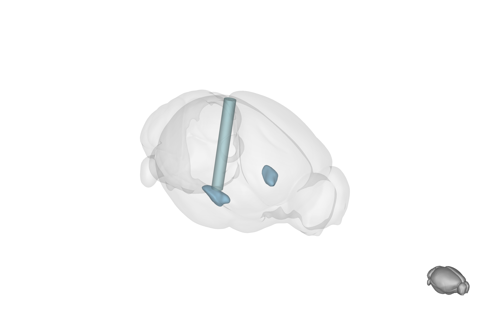
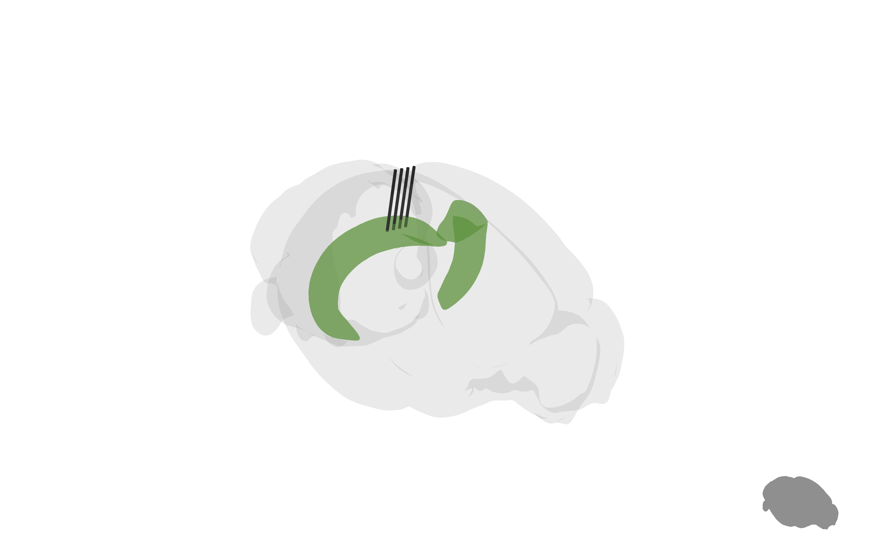

# BrainRender
`brainrender` is a python package for the visualization of three dimensional anatomical data from mice brains registered to the Common Coordinate Framework (CCF) from the Allen Institute. Check the [user guide](Docs/UserGuide.md) and the [examples](Examples) notebooks for more information on how to use BrainRender.


# Installation
To install `brainrender`, use an existing python environment or create one [with `python < 3.8`] and install with:
```
pip install brainrender
```


# Resources
`brainrender` can be used to download and visualize anatomical data from publicly available datasets. 
These include the Allen Mouse Brain Atlas, the Allen Mouse Connectome project and neuronal morphological data from the MouseLight project from Janelia. 


Brain structures             |  Afferent projections
:-------------------------:|:-------------------------:
  |  

Efferent projections             |  MouseLight neurons
:-------------------------:|:-------------------------:
  |  


### Allen Mouse Brain Atlas
Anatomical and projection data is downloaded from the  Allen Brain Atlas [reference atlas](http://atlas.brain-map.org)
and [connectivity atlas](http://connectivity.brain-map.org) using the Allen [API](http://help.brain-map.org/display/api/Allen%2BBrain%2BAtlas%2BAPI)
(© 2015 Allen Institute for Brain Science. Allen Brain Atlas API. Available from: [brain-map.org/api/index.html](brain-map.org/api/index.html)) ([1], [2]).

An interactive, in-browser 3D structure viewer, the Allen Brain Explorer, is available [here](http://connectivity.brain-map.org/3d-viewer?v=1). 

### Streamlines
Efferent anatomical projections [as determined by local injections of an anterogradely transported virus (see [Allen's connectivity atlas](http://connectivity.brain-map.org))] can be rendered as 'streamlines'.

Streamlines reconstructions are made by [https://neuroinformatics.nl](https://neuroinformatics.nl) using the mouse connectome data from Allen (see [here](https://neuroinformatics.nl/HBP/allen-connectivity-viewer/streamline-downloader.html) for more details).

### Mouselight and neurons morphology
Neurons morphological data is from Janelia's [mouse light](https://www.janelia.org/project-team/mouselight) database
(see the [neurons browser](http://ml-neuronbrowser.janelia.org)). [3]

Brainrender can be used to visualise neuronal morphologies from other sources by loading `.swc` files with the `AllenMorphology` class. This class is also used to download morphologies from the Allen Cell Types project. 
A large number of neuronal morphologies can be found at [neuromorpho](https://www.neuromorpho.org).


  |   |  
:-------------------------:|:-------------------------:|:-------------------------:


## 3D rendering in python
To create 3D renderings `brainrender` relies on [vtkplotter](https://vtkplotter.embl.es) [see [github repo](https://github.com/marcomusy/vtkPlotter)], a python package for 3D visualization.

`brainrender` leverages the flexibility in specifying the look of rendered objects afforded by `vtkplotter` to let users create the look they need for high-quality scientific figures and illustrations. Examples of this are displayed throught the 
[examples](Examples), but one easy way is to set `brainrender`'s rendering style to `cartoon` to get accurate schematics of brain region's anatomy to use for figures:

Top view of the Zona Incerta


### Making figures
Thanks to `vtkplotter`, `brainrender` can be used to render 3d objects loaded from `.obj` and `.stl` files, making it easy to add objects to a rendering (e.g. implanted electrodes arrays) for creating illustrations. Additionally, `brainrender` has some functions that can be used to render commonly used items such as optic cannullas (e.g. for optogenetics) and electrods arrays:

Optic cannula            |  Electrodes array
:-------------------------:|:-------------------------:
  |  

## Referencing Brain Render
If you found BrainRender useful and decided to include a rendering in your talks, posters or article, please acknowledge BrainRender's contribution.


# Similar tools
## In R
`cocoframer` is an R library for interacting with the Allen's Mouse CCF [github repository](https://github.com/AllenInstitute/cocoframer).

`mouselightr` package generates 3D CCF mouse brain plots, along with MouseLight neuron reconstructions [github repository](https://github.com/jefferis/nat.mouselight)

## References
* [1] Lein, E.S. et al. (2007) Genome-wide atlas of gene expression in the adult mouse brain, Nature 445: 168-176. doi:10.1038/nature05453
* [2] Oh, S.W. et al. (2014) A mesoscale connectome of the mouse brain, Nature 508: 207-214. doi:10.1038/nature13186
* [3]  Winnubst, J. et al. (2019) Reconstruction of 1,000 Projection Neurons Reveals New Cell Types and Organization of Long-Range Connectivity in the Mouse Brain, Cell 179: 268-281
<!-- * [4] [Papp et al. 2014](https://www.sciencedirect.com/science/article/pii/S1053811914002419)
* [5] [Kjonigsen et al. 2015](https://www.sciencedirect.com/science/article/pii/S105381191500004X) -->
